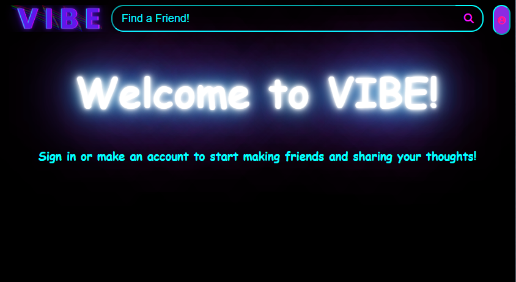
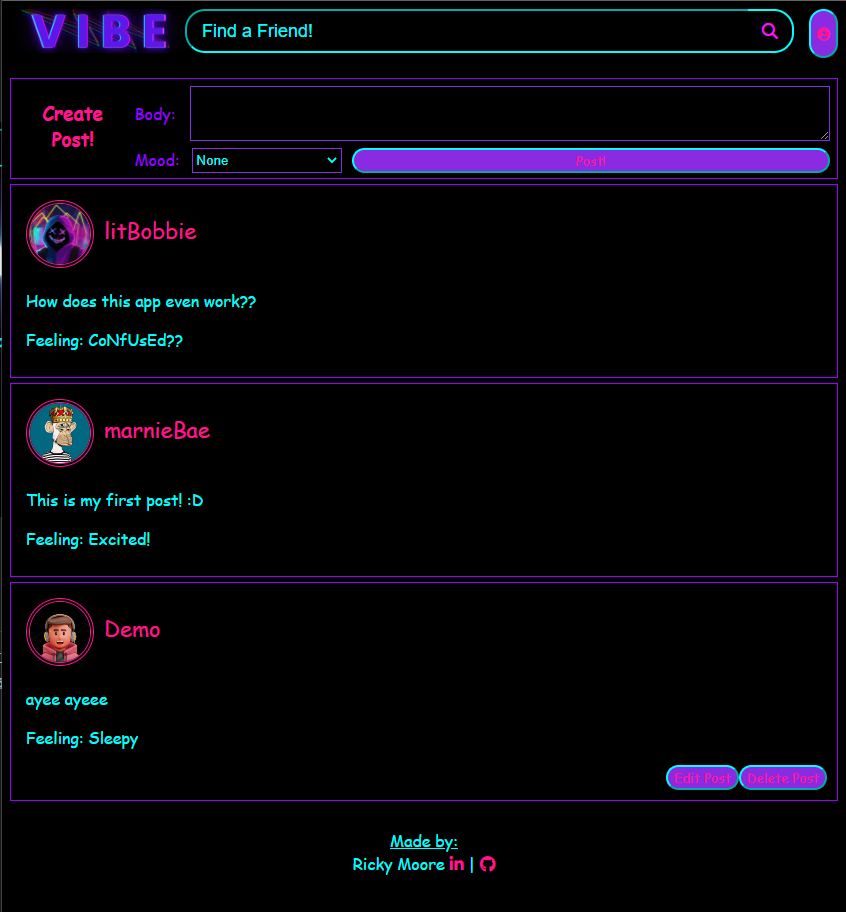
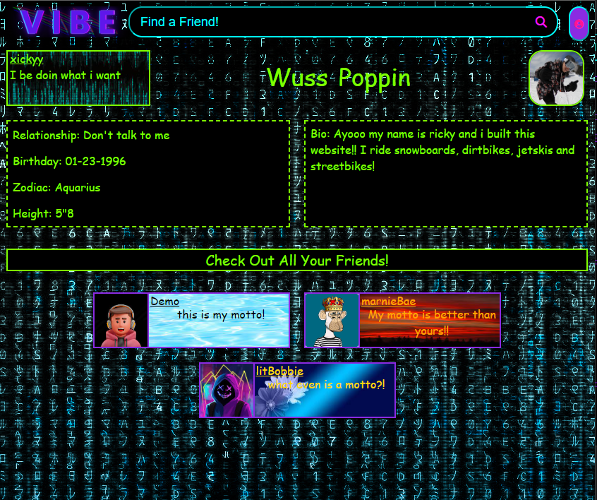
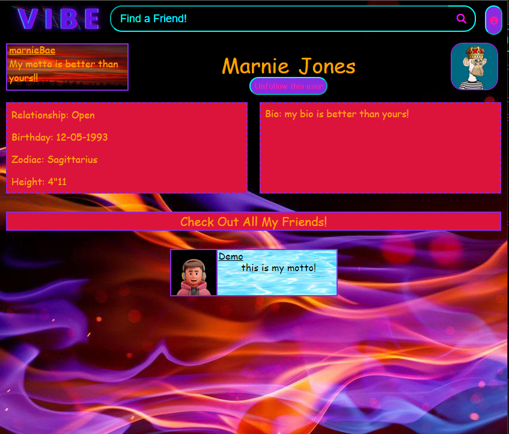
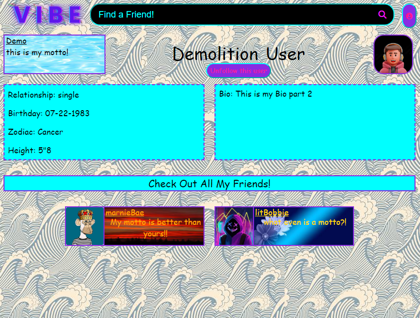
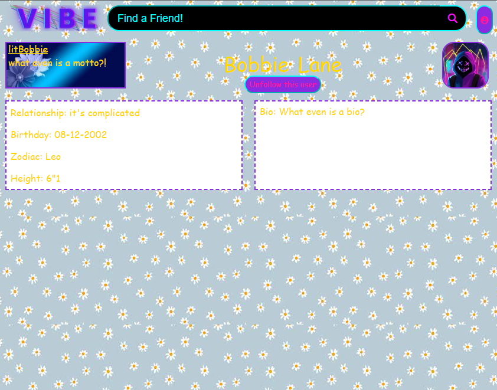

# Flask React Project

This is my very own social media platform named Vibe!
it currently includes 5 different features.
Two full Crud features being able to Create, Read, Update & Delete Users and Posts.
The other 3 features are the ability to add friends, search for other profiles and customize your
profile page!

in the future there will be many more features such as a messaging system, profile music, aws implimentation, and much more!

-Currently worrking on implimenting a messaging system

link to live site - https://vibe-qrb9.onrender.com/

Some of the technologies ive used for this project are having a python backend for all my Api's
most of the front end is written in javascript whilst utalizing React and Jsx for a smooth
user experience.


## Getting started
1. Clone this repository (only this branch)

2. Install dependencies

      ```bash
      pipenv install -r requirements.txt
      ```

3. Create a **.env** file based on the example with proper settings for your
   development environment

4. Make sure the SQLite3 database connection URL is in the **.env** file

5. This starter organizes all tables inside the `flask_schema` schema, defined
   by the `SCHEMA` environment variable.  Replace the value for
   `SCHEMA` with a unique name, **making sure you use the snake_case
   convention**.

6. Get into your pipenv, migrate your database, seed your database, and run your Flask app

   ```bash
   pipenv shell
   ```

   ```bash
   flask db upgrade
   ```

   ```bash
   flask seed all
   ```

   ```bash
   flask run
   ```

7. To run the React App in development, checkout the [README](./react-app/README.md) inside the `react-app` directory.

When all is said and done you should have your site up, running and looking like this!



you can click the button on the top right to either login, sign up or login to a demo user,
if you click on a the demo user login you should see this



if you chose to create a new account you will get the same page but without and posts (as you will not currently be following anyone)

here are some seeder accounts that provide examples of the customization you can accomplish on your profile page.


*

*

*

